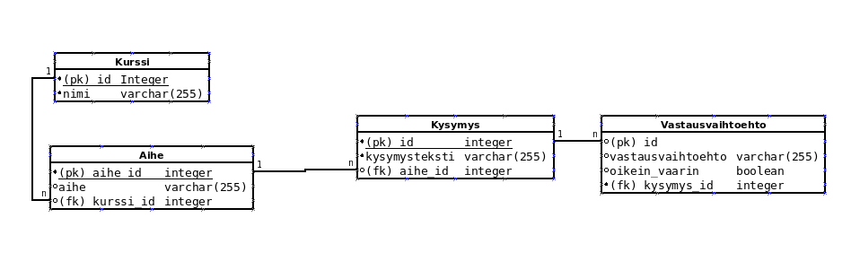

# tikape-harjoitustyo2

Ohjelman tietokantakaavio näyttää seuraavalta:

Luokissa tietokantataulun vierasavaimia vastaavat attribuutit on nimetty camelCase-muotoon. Eli esim. tietokantataulun aihe_id on aiheId.

Ohjelmassa on mahdollista lisätä saman kurssin samaan aiheeseen useampia kysymyksiä halutessaan. Kun käyttäjä poistaa kurssin ainoaan aiheeseen liittyvän kysymyksen, myös kurssi poistetaan.
